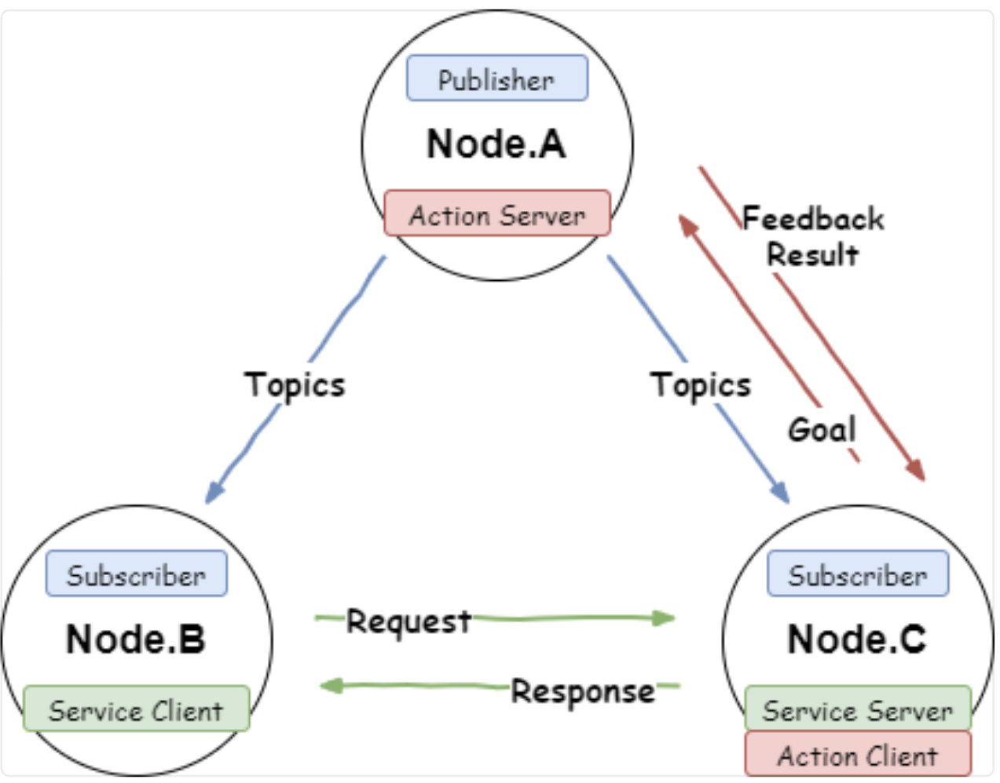
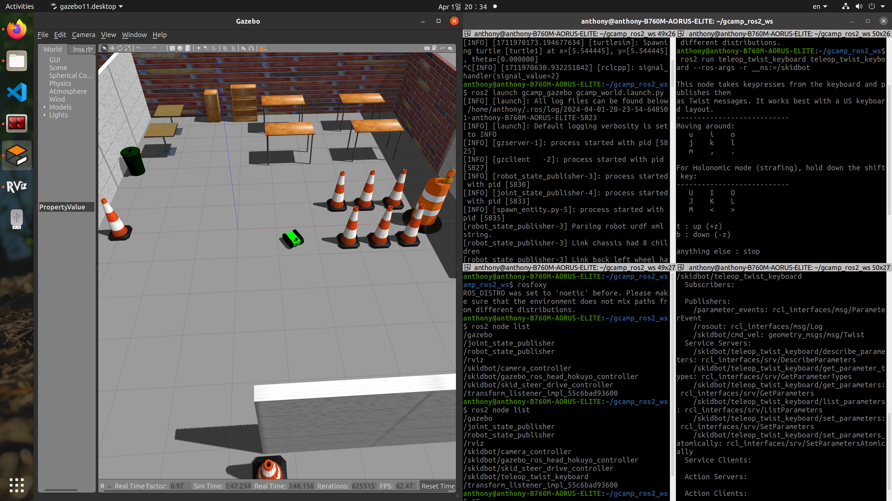
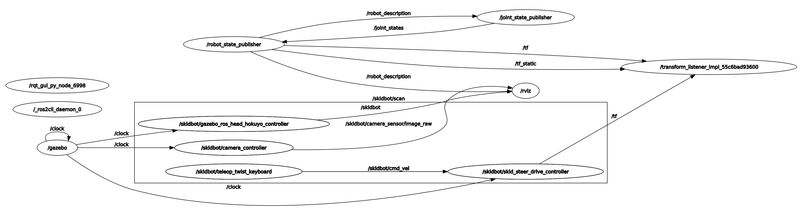

# Node and Package

- Node : ROS에서 최소 단위의 실행 가능한 프로세스, 하나의 목적
- 각 node는 메시지 통신을 통해 데이터를 주고 받는다. (topic, service, action)
- 각 node는 역할이 있다. (publisher, subscriber, service client, service server, action client, action server)

## Topic, Service, Action



|Topic|Service|Action|
|:---:|:---:|:---:|
|publisher node -> subscriber node|service client node <-> service server node|action client node <-> action server node|
|정보를 보내는 publisher와 정보를 받는 subscriber가 topic 메시지 형태로 정보를 송수신하는 것|client가 호출할 때만 server가 데이터를 제공한다.|client가 server에게 goal을 보내면 server는 goal를 확인할 후 feedback과 result를 반환한다.|
|짧은 시간 동안 실행되는 작업||긴 시간 동안 실행되는 작업|
|단방향|쌍방향|쌍방향|
|비동기식|동기식|비동기식|
|연속적 데이터|이산적 데이터|이산적 데이터|
|1:N, N:1, N:N|1:1|1:1|

## Node

### Node Command

**단일 노드 실행 명령어**

```bash
ros2 run [PACKAGE_NAME] [PROGRAM_NAME]
```

**실행 중인 Node들의 리스트를 확인하는 명령어**

```bash
ros2 node list
```

**특정 Node의 정보 살펴보기**

```bash
ros2 node info [NODE_NAME]
```

키보드를 이용해 GAZEBO 상의 모바일 로봇을 control하는 예제



```bash
anthony@anthony-B760M-AORUS-ELITE:~/gcamp_ros2_ws$ ros2 node list
/gazebo
/joint_state_publisher
/robot_state_publisher
/rviz
/skidbot/camera_controller
/skidbot/gazebo_ros_head_hokuyo_controller
/skidbot/skid_steer_drive_controller
/skidbot/teleop_twist_keyboard
/transform_listener_impl_55c6bad93600
```

```bash
anthony@anthony-B760M-AORUS-ELITE:~/gcamp_ros2_ws$ ros2 node info /skidbot/teleop_twist_keyboard

/skidbot/teleop_twist_keyboard

# Topic
Subscribers:

Publishers:
/parameter_events: rcl_interfaces/msg/ParameterEvent
/rosout: rcl_interfaces/msg/Log
/skidbot/cmd_vel: geometry_msgs/msg/Twist

# Service
Service Servers:
/skidbot/teleop_twist_keyboard/describe_parameters: rcl_interfaces/srv/DescribeParameters
/skidbot/teleop_twist_keyboard/get_parameter_types: rcl_interfaces/srv/GetParameterTypes
/skidbot/teleop_twist_keyboard/get_parameters: rcl_interfaces/srv/GetParameters
/skidbot/teleop_twist_keyboard/list_parameters: rcl_interfaces/srv/ListParameters
/skidbot/teleop_twist_keyboard/set_parameters: rcl_interfaces/srv/SetParameters
/skidbot/teleop_twist_keyboard/set_parameters_atomically: rcl_interfaces/srv/SetParametersAtomically

Service Clients:

# Action
Action Servers:

Action Clients:
```

### Rqt

**Rqt 실행 명령어**

```bash
rqt_graph
```


- 각 동그라미는 node를 의미한다.
- 화살표는 한 node에서 다른 node로 데이터를 보내고 있다는 것이다.
- 화살표 중간에 있는 것은 데이터를 보낼 때의 이름이다.

## Package

- 여러 package를 조합해서 로봇을 만든다.
- 하나의 github repository가 package다.
- descriptioin : 로봇의 모델링(외관)에 관한 package
- drive : 하드웨어 drive와 상호작용하는 package
- 주로 사용되는 package는 동일한 것이 많다.
- urdf : modeling file
- 파일 관점 : 관련된 라이브러리, 모델링 파일, 설정 파일들을 모아둔 폴더
- 기능 관점 : 시뮬레이션, 하드웨어, 모델링, 원격 조종 등으로 분리시킨 모듈

## Reference

- [ROS2 DOCS : Topics vs Services vs Actions](https://docs.ros.org/en/foxy/How-To-Guides/Topics-Services-Actions.html#topics)
- [ROS2 하루에 입문하기 - 02장 ROS2 사용방법(Topic, Service, Action 등)](https://robertchoi.gitbook.io/ros2/02-ros2)
