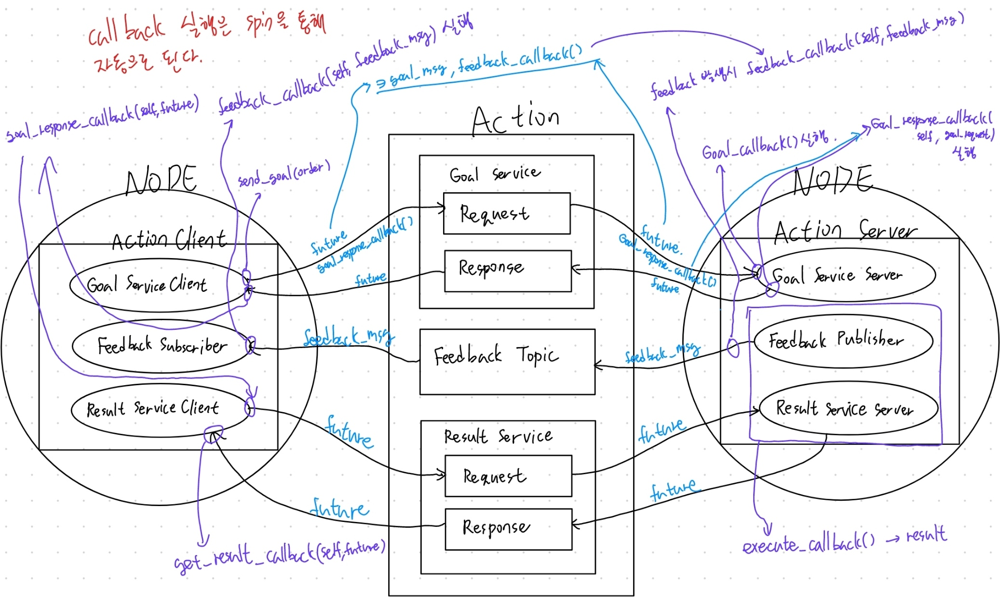

# Action programming with python

## Action server code 분석
```python
#!/usr/bin/env/ python3

import time

"""
'Fibonacci' action 자료형 import
Component:
    # Goal
    int32 order
    ---
    # Result
    int32[] sequence
    ---
    # Feedback
    int32[] partial_sequence
"""
from custom_interfaces.action import Fibonacci


import rclpy
from rclpy.action import ActionServer, GoalResponse
from rclpy.node import Node


# Node 상속하여 class 작성
class FibonacciActionServer(Node):
    # 생성자 선언
    def __init__(self):
        # 부모 노드 생성자 함수 사용: 노드 이름 설정.
        super().__init__('fibonacci_action_server')
        # action server 생성. rclpy.action.ActionServer() 함수 이용
        self.action_server = ActionServer(
            self, # 액션 서버를 담는 객체 
            Fibonacci, # 사용할 자료형 
            'fibonacci', # 액션 서버 이름
            # goal request가 오면 goal_callback 실행 후 
            # execute_callback을 실행한다.
            self.execute_callback, 
            goal_callback=self.goal_callback,
        )

        # 문자열을 로그에 올린다.
        self.get_logger().info('=== Fibonacci Action Server Started ====')

    # goal_callback 이후 실행되는 callback, 
	# 실제 Feedback과 Result를 처리한다.
    # 입력으로 goal_handle(order 포함.)을 받는다.
    async def execute_callback(self, goal_handle):
        # 로그 작성
        self.get_logger().info('Executing goal...')

        # 피드백 객체 생성 후 feedback msg의 초기값 입력
        feedback_msg = Fibonacci.Feedback()
        feedback_msg.partial_sequence = [0, 1]

        # [order - 1]만큼 for문 반복
        for i in range(1, goal_handle.request.order):
            # 캔슬이 요청된 경우
            if goal_handle.is_cancel_requested:
                # goal_handle의 canceled를 실행
                goal_handle.canceled()
                # 로그를 띄우고
                self.get_logger().info('Goal canceled')
                # result를 반환하며 callback을 종료한다.
                return Fibonacci.Result()

            # feedback msg 배열의 인자를 하나 늘린다.(피보나치 수열로.)
            feedback_msg.partial_sequence.append(
                feedback_msg.partial_sequence[i] + feedback_msg.partial_sequence[i - 1]
            )

            # 로그로 피드백 메시지를 띄운다.
            self.get_logger().info(f'Feedback: {feedback_msg.partial_sequence}')
            # 피드백 메시지를 publish한다.
            goal_handle.publish_feedback(feedback_msg)
            # 1초간 멈춘다.
            time.sleep(1)

        # goal_handle의 succeed함수 실행
        goal_handle.succeed()
        # 성공했음을 로그를 띄워 알린다.
        self.get_logger().warn('==== Succeed ====')

        # Result 객체 생성 후 결과를 복사.
        result = Fibonacci.Result()
        result.sequence = feedback_msg.partial_sequence

        return result

    # goal request가 들어오면 실행하게 될 함수.
    def goal_callback(self, goal_request):
        """Accept or reject a client request to begin an action."""
        # This server allows multiple goals in parallel
        self.get_logger().info(f'Received goal request:\'Give me {goal_request.order + 1} Fibonacci numbers!\' ')
        return GoalResponse.ACCEPT


def main(args=None):
    # rclpy 초기화
    rclpy.init(args=args)

    # 액션 서버 객체 생성
    fibonacci_action_server = FibonacciActionServer()
    # 액션 서버 실행
    rclpy.spin(fibonacci_action_server)
    # 액션 서버 제거
    fibonacci_action_server.destroy()
    # rclpy 환경 제거
    rclpy.shutdown()


if __name__ == '__main__':
    main()

```

## Action server with cancel & multi thread
이 액션 서버는 캔슬되었을 때의 동작을 정의할 수 있으며, 여러 액션 클라이언트의 요청을 동시에 처리할 수 있습니다. (위 코드와 겹치는 부분의 대다수는 주석을 생략하였습니다.)
```python
# !/usr/bin/env/ python3

import time

from custom_interfaces.action import Fibonacci

import rclpy
from rclpy.action import ActionServer, CancelResponse, GoalResponse
from rclpy.callback_groups import ReentrantCallbackGroup 
from rclpy.executors import MultiThreadedExecutor
from rclpy.node import Node


class FibonacciActionServer(Node):

    def __init__(self):
        super().__init__('fibonacci_action_server')
        self.action_server = ActionServer(
            self, # 액션 서버를 담는 노드 객체 
            Fibonacci, # 액션 타입 
            'fibonacci', # 액션 서버 이름
            # 모든 callback함수가 제한 없이 병렬로 실행될 수 있게 한다. 
            # 이 인자에 다른 callback_groups 내의 class
            # 객체를 넣으면 다른 옵션을 선택할 수 있다.
            callback_group=ReentrantCallbackGroup(), 
            execute_callback=self.execute_callback, 
            goal_callback=self.goal_callback,
            cancel_callback=self.cancel_callback, # 캔슬되었을 때 실행할 함수
        )

        self.get_logger().info('=== Fibonacci Action Server Started ====')

    async def execute_callback(self, goal_handle):
        self.get_logger().info('Executing goal...')

        feedback_msg = Fibonacci.Feedback()
        feedback_msg.partial_sequence = [0, 1]

        for i in range(1, goal_handle.request.order):

            if goal_handle.is_cancel_requested:
                goal_handle.canceled()
                self.get_logger().info('Goal canceled')
                return Fibonacci.Result()

            feedback_msg.partial_sequence.append(
                feedback_msg.partial_sequence[i] + feedback_msg.partial_sequence[i - 1]
            )

            self.get_logger().info(f'Feedback: {feedback_msg.partial_sequence}')
            goal_handle.publish_feedback(feedback_msg)
            time.sleep(1)

        goal_handle.succeed()
        self.get_logger().warn('==== Succeed ====')

        result = Fibonacci.Result()
        result.sequence = feedback_msg.partial_sequence
        return result

    def goal_callback(self, goal_request):
        """Accept or reject a client request to begin an action."""
        # This server allows multiple goals in parallel
        self.get_logger().info('Received goal request')
        return GoalResponse.ACCEPT

    # 이 cancel_callback함수가 추가적으로 선언되었다.
    def cancel_callback(self, goal_handle):
        """Accept or reject a client request to cancel an action."""
        self.get_logger().info('Received cancel request')
        return CancelResponse.ACCEPT


def main(args=None):
    rclpy.init(args=args)

    fibonacci_action_server = FibonacciActionServer()

    # 멀티 쓰레딩을 사용하기 위한 MultiThreadedExecutor 객체 생성.
    executor = MultiThreadedExecutor()
    # 액션 서버를 실행한다. 또한, spin 함수의 인풋으로 executor에 MultiThreadedExecutor 객체를
    # 할당하면 여러 개의 클라이언트의 요청을 동시에 수행할 수 있다.
    rclpy.spin(fibonacci_action_server, executor=executor)

    fibonacci_action_server.destroy()
    rclpy.shutdown()


if __name__ == '__main__':
    main()

```
[CallbackGroup-ref](https://docs.ros2.org/foxy/api/rclpy/api/execution_and_callbacks.html#rclpy.callback_groups.ReentrantCallbackGroup)

## Action Client code 분석

```python
# !/usr/bin/env/ python3
from custom_interfaces.action import Fibonacci

# 노드를 만들기 위함.
import rclpy
from rclpy.node import Node

# 액션 클라이언트를 만들기 위함.
from rclpy.action import ActionClient

# 상속
class FibonacciActionClient(Node):

    def __init__(self):
        # 부모 class 생성자 : 노드 이름 설정
        super().__init__('fibonacci_action_client')
        # 액션 클라이언트 변수에 액션 클라이언트 객체 할당.
        # 인풋으로는 이 변수를 가지는 객체(self), 액션 타입, 액션 서버 이름 을 사용
        self.action_client = ActionClient(self, Fibonacci, 'fibonacci')
        # 로그를 띄움.
        self.get_logger().info('=== Fibonacci Action Client Started ====')

    # 이 함수는 콜백이 아님. 바로 사용하여 액션 서버에 명령을 보낸다.
    def send_goal(self, order):
        # 변수에 Goal객체 할당.
        goal_msg = Fibonacci.Goal()
        # order 할당
        goal_msg.order = order

        # 10초동안 서버를 기다렸을 때 반응이 없으면, 에러메시지를 로그로 띄운다.
        if self.action_client.wait_for_server(10) is False:
            self.get_logger().error('Server Not exists')

        # goal request가 제대로 보내졌는지 알기 위해 future 사용.
        # 이 함수에 인자로 goal 메시지와 feedback 발생시 실행할 콜백함수를 넣는다.
        self._send_goal_future = self.action_client.send_goal_async(
            goal_msg, feedback_callback=self.feedback_callback
        )

        # Goal Request의 성공 유무, 최종 Result에 대한 callback 함수를 사용한다.
        self._send_goal_future.add_done_callback(self.goal_response_callback)
    
    # feedbck 발생시 실행되는 콜백 함수
    def feedback_callback(self, feedback_msg):
        # 피드백 메시지를 받아 로그로 띄운다.
        feedback = feedback_msg.feedback
        self.get_logger().info(f'Received feedback: {feedback.partial_sequence}')

    # Goal Request에 대한 응답시 실행되는 콜백 함수
    def goal_response_callback(self, future):
        # future로부터 결과를 받는다.
        goal_handle = future.result()

        # 만약 Goal type이 accepted가 아니면 다음을 표시하고 함수를 종료한다.
        if not goal_handle.accepted:
            self.get_logger().info('Goal rejected')
            return

        self.get_logger().info('Goal accepted')
        # goal ? 
        self._get_result_future = goal_handle.get_result_async()
        # Result 데이터를 받을 콜백함수를 할당한다.
        self._get_result_future.add_done_callback(self.get_result_callback)

    # Result callback 함수. future을 받아와 결과를 출력한다.
    def get_result_callback(self, future):
        result = future.result().result
        self.get_logger().warn(f'Action Done !! Result: {result.sequence}')
        # 모든 행동이 종료되면 노드를 종료한다.
        rclpy.shutdown()


def main(args=None):
    # 노드 환경 조성
    rclpy.init(args=args)

    # 클라이언트 노드 생성
    fibonacci_action_client = FibonacciActionClient()

    # goal 전송
    fibonacci_action_client.send_goal(5)
    # future = fibonacci_action_client.send_goal(5)

    # 클라이언트 실행
    rclpy.spin(fibonacci_action_client)


if __name__ == '__main__':
    main()

```

## Cancel이 들어간 Action Client code 분석
다른 부분만 주석을 달았다.
```python
# !/usr/bin/env/ python3
from custom_interfaces.action import Fibonacci

import rclpy
from rclpy.action import ActionClient
from rclpy.node import Node


class FibonacciActionClient(Node):

    def __init__(self):
        super().__init__('fibonacci_action_client')
        self.action_client = ActionClient(self, Fibonacci, 'fibonacci')
        self.goal_handle = None
        self.get_logger().info('=== Fibonacci Action Client Started ====')

    def send_goal(self, order):
        goal_msg = Fibonacci.Goal()
        goal_msg.order = order

        if self.action_client.wait_for_server(10) is False:
            self.get_logger().error('Server Not exists')

        self._send_goal_future = self.action_client.send_goal_async(
            goal_msg, feedback_callback=self.feedback_callback
        )

        self._send_goal_future.add_done_callback(self.goal_response_callback)

    def feedback_callback(self, feedback_msg):
        feedback = feedback_msg.feedback
        self.get_logger().info(f'Received feedback: {feedback.partial_sequence}')

    def goal_response_callback(self, future):
        self.goal_handle = future.result()

        if not self.goal_handle.accepted:
            self.get_logger().info('Goal rejected')
            return

        self.get_logger().info('Goal accepted')
        
        # goal이 accept되었을 때 캔슬할 타이머를 create_timer함수로 만든다.
        # Start a 2 second timer
        self.timer = self.create_timer(2.0, self.timer_callback)

    # 타이머가 다 되었을 때 실행할 콜백 함수
    def timer_callback(self):
        self.get_logger().info('Canceling goal')
        # Cancel the goal
        future = self.goal_handle.cancel_goal_async()
        future.add_done_callback(self.cancel_done)

        # Cancel the timer
        self.timer.cancel()


    def cancel_done(self, future):
        # 결과를 가져온다.
        cancel_response = future.result()
        if len(cancel_response.goals_canceling) > 0:
            self.get_logger().info('Goal successfully canceled')
        else:
            self.get_logger().info('Goal failed to cancel')
        # 노드 종료
        rclpy.shutdown()


def main(args=None):
    rclpy.init(args=args)

    fibonacci_action_client = FibonacciActionClient()

    fibonacci_action_client.send_goal(5)

    rclpy.spin(fibonacci_action_client)


if __name__ == '__main__':
    main()

```

## 정리


### Action Server callback function
액션 서버를 생성할 때(`self.action_server = ActionServer()`) 필요한 callback 함수는 다음과 같은 것들이 필요합니다.  

`goal_callback(self, goal_request)`  
- Goal request가 들어오면 실행하게 되는 함수.
- Goal이 Accept 되었는지 Return 한다.

`execute_callback(self, goal_handle)`   
- goal_callback 이후 실행되는 함수.
- goal_handle 을 통해 goal정보와 cancel 여부를 알 수 있음.
- `goal_handle.publish_feedback(<메시지>)`를 통해 feedback.
- `goal_handle.succed()`를 통해 성공 여부 전달.
- return으로 최종 결과(Result)을 보낸다.

### Action Client functions

`def send_goal(self, order)`   
- Goal request를 보내는 함수.
- `self._send_goal_future = self.action_client.send_goal_async(goal_msg, feedback_callback=self.feedback_callback)` : goal request가 제대로 보내졌는지 알기 위해 future 사용. goal과 feedback 이 들어왔을 때 사용할 콜백함수를 할당한다.
- `self._send_goal_future.add_done_callback(self.goal_response_callback)` Goal response를 통해 request가 성공했는지, goal response가 왔을 때 실행할 콜백을 할당한다.

`feedback_callback(self, feedback_msg)`  
- Goal Service에서 future에 포함되어 액션 서버로 전달되는 함수.
- 이 함수는 feedback이 발생하면 실행되는 함수이다.


`goal_response_callback(self, future)`  
- Goal service의 response를 받을 때 실행되는 함수이다.
- Goal service의 future을 매개변수로 받고, Result service의 request를 보낸다.


`get_result_callback(self, future)`  
- Result service의 Response를 받으면 실행되는 함수.
- Result service의 Response future을 매개변수로 받는다.


